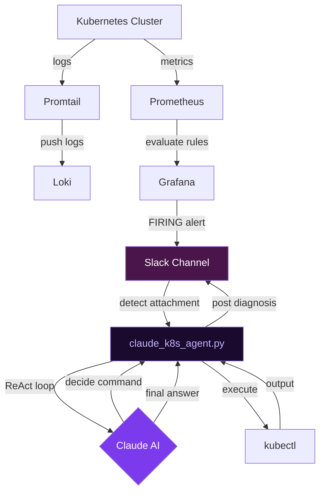
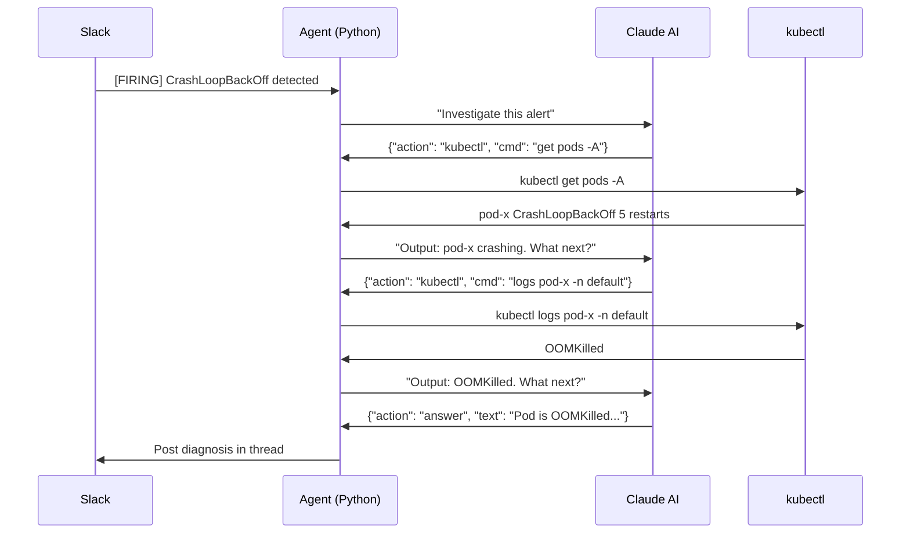

# Intelligence Ops 🤖

> AI-powered Kubernetes monitoring agent that automatically investigates cluster issues and delivers diagnosis to Slack using ReAct pattern.

---

## Overview

Intelligence Ops is an autonomous SRE agent that bridges the gap between traditional monitoring tools and intelligent incident response. When an issue occurs in your Kubernetes cluster, Intelligence Ops automatically:

1. **Detects** anomalies via Prometheus alert rules
2. **Receives** alerts through Slack (via Grafana)
3. **Investigates** the cluster dynamically using ReAct pattern
4. **Delivers** a complete diagnosis back to Slack — in seconds

No more manual `kubectl` hunting. No more context switching. Just answers.

---

## Architecture



---

## ReAct Pattern

The core of Intelligence Ops is the **ReAct (Reasoning + Acting)** pattern — a 2022 research concept where AI iteratively thinks, acts, and observes until it has enough information to answer.



**Claude decides** what to investigate. **Python executes** the commands. Enterprise policies that block AI from running bash directly are bypassed elegantly — Claude only reasons, Python acts.

---

## Building Blocks

| Component | Role | Tools Used |
|-----------|------|-----------|
| Container Orchestration | Where your apps run | Kubernetes (Kind for local) |
| Observability Stack | Detect anomalies | Prometheus + Grafana + Loki + Promtail |
| Communication Channel | Alert + response interface | Slack |
| AI / LLM | Reasoning and diagnosis | Claude (via CLI) |
| Agent Orchestrator | Glue everything together | Python (`claude_k8s_agent.py`) |

> The building block approach means you can swap any component. Using Teams instead of Slack? GPT-4 instead of Claude? The system adapts.

---

## Prerequisites

- Docker
- [Kind](https://kind.sigs.k8s.io/) or any Kubernetes cluster
- kubectl
- [Claude CLI](https://claude.ai/code) (logged in)
- Python 3.8+
- Helm 3+
- Slack workspace with admin access

---

## Installation

### 1. Clone the repository

```bash
git clone https://github.com/ludesdeveloper/intelligence-ops.git
cd intelligence-ops
```

### 2. Setup Kubernetes cluster (local)

```bash
# Create cluster
kind create cluster

# Verify
kubectl get nodes
```

### 3. Install observability stack

```bash
# Add helm repos
helm repo add prometheus-community https://prometheus-community.github.io/helm-charts
helm repo add grafana https://grafana.github.io/helm-charts
helm repo update

# Create namespace
kubectl create namespace monitoring

# Install Prometheus + Grafana + Alertmanager
helm install monitoring prometheus-community/kube-prometheus-stack \
  --namespace monitoring \
  --set grafana.adminPassword=admin123 \
  --set grafana.sidecar.datasources.enabled=true \
  --set alertmanager.enabled=true \
  --wait

# Fix inotify limits (required for Promtail on Kind)
sudo sysctl -w fs.inotify.max_user_instances=512
sudo sysctl -w fs.inotify.max_user_watches=524288

# Install Loki
helm install loki grafana/loki \
  --namespace monitoring \
  --set deploymentMode=SingleBinary \
  --set loki.auth_enabled=false \
  --set loki.commonConfig.replication_factor=1 \
  --set loki.storage.type=filesystem \
  --set singleBinary.replicas=1 \
  --set read.replicas=0 \
  --set write.replicas=0 \
  --set backend.replicas=0 \
  --set loki.useTestSchema=true \
  --wait

# Install Promtail
helm install promtail grafana/promtail \
  --namespace monitoring \
  --set config.lokiAddress=http://loki-gateway.monitoring.svc.cluster.local:80/loki/api/v1/push \
  --wait
```

### 4. Setup Python environment

```bash
python3 -m venv venv
source venv/bin/activate
pip install slack-bolt python-dotenv
```

### 5. Setup Slack

- Create a Slack app at https://api.slack.com/apps
- Add Bot Token Scopes: `app_mentions:read`, `channels:history`, `channels:read`, `chat:write`
- Enable Socket Mode and generate App Token
- Subscribe to events: `app_mention`, `message.channels`
- Install app to workspace

### 6. Configure environment

```bash
cp .env.example .env
```

Edit `.env`:

```env
SLACK_BOT_TOKEN=xoxb-...
SLACK_APP_TOKEN=xapp-...
```

### 7. Setup alert rules

```bash
kubectl apply -f alert-rules/crashloop-alert.yaml
```

### 8. Configure Grafana → Slack notification

- Open Grafana: `kubectl port-forward -n monitoring svc/monitoring-grafana 3000:80`
- Go to Alerting → Contact Points → Add Slack contact point
- Set recipient and bot token
- Set notification policy to use Slack contact point

---

## Usage

### Start the agent

```bash
source venv/bin/activate
python3 claude_k8s_agent.py
```

```
✅ claude_k8s_agent.py starting...
👂 Listening: manual mention + Grafana alerts
⚡️ Bolt app is running!
```

### Manual investigation

Mention the bot in Slack:

```
@intelligence-ops-bot check my cluster
@intelligence-ops-bot why is my pod crashing?
@intelligence-ops-bot check resource usage in production namespace
```

### Automatic investigation

Deploy a crashloop pod to trigger the full automated flow:

```bash
kubectl run crashloop-demo \
  --image=busybox \
  --restart=Always \
  -- sh -c "echo 'crashing' && exit 1"
```

Within 1-2 minutes:
1. Prometheus detects CrashLoopBackOff
2. Grafana fires alert to Slack
3. Agent detects `[FIRING` in Slack message attachments
4. ReAct loop investigates cluster
5. Claude posts diagnosis in Slack thread

Cleanup:

```bash
kubectl delete pod crashloop-demo
```

---

## Project Structure

```
intelligence-ops/
├── claude_k8s_agent.py      # Main agent
├── alert-rules/
│   └── crashloop-alert.yaml # Prometheus alert rules
├── .env.example             # Environment template
├── requirements.txt         # Python dependencies
└── README.md
```

---

## How It Works

### Two Triggers

**Trigger 1: Manual Mention**
```
User: @intelligence-ops-bot check pods
         ↓
app_mention event
         ↓
ReAct loop
         ↓
Diagnosis in thread
```

**Trigger 2: Grafana Alert**
```
Grafana fires alert → Slack
         ↓
Agent detects [FIRING in attachments
(not in text field — Grafana sends alerts in attachments!)
         ↓
ReAct loop
         ↓
Diagnosis in thread
```

### Why Attachments, Not Text?

Grafana sends alerts with an empty `text` field. The actual alert content is in the `attachments` array. This is a common gotcha when integrating Grafana with Slack bots.

```python
# Wrong - always empty from Grafana
text = event.get("text", "")

# Correct
attachments = event.get("attachments", [])
attachment_text = attachments[0].get("title", "") + attachments[0].get("text", "")
```

---

## Known Limitations

- Claude Enterprise policy may block bash tool execution — this is by design. The ReAct pattern was specifically chosen to work within enterprise constraints.
- Claude CLI must be authenticated and available in PATH
- Grafana alert to Slack requires incoming webhook or bot token configured as contact point

---

*Built with frustration, curiosity, and too many CrashLoopBackOffs.* 😄